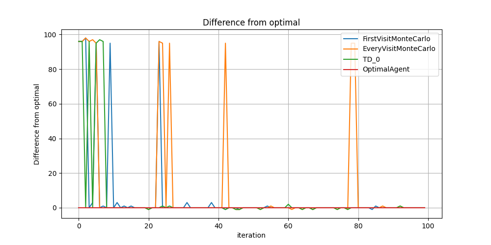

# Assignment 1

Name: Ng Tze Kean

Student number: 721370290002

## Architecture

The built is similar to that of Lab 1. We create 3 classes for the model that we want to implement and a experiment class as  a controller to help us run our experiment. The scope of the experiment will be to generate a episode with random actions that reaches the goal state and it will be used to train the model. The agents will be trained with different start points and be made to find the optimal path at different start points as well.

## Monte carlo first visit and every visit

In this model free experiment, we get the random agent to walk around the grid till the terminal state as a sample which will be used to train the model. Monte carlo learning is based off iterating through the complete episode, and the $G_t$ for each first visit to the state will be used along with the reward received to form an estimate for the value of the current state. When the number of episodes is huge, then the estimated value of the states will be close to the true values. Instead of appending the $G_t$ to a list before dividing it by the length of the list, we massage the mathematical formula to reduce the memory needed for the agent.

## TD 0

TD uses each state within the episode as a guess to guess the next value of the
next state, thus bootstrapping the learning. As there is no knowledge of the
transition probability or reward known to the model, TD 0 is model-free and thus have 

## Results

From the iteration of each episode, we can see how the delta from optimal is high for all 3 algorithm in the first few training episodes and it quickly decreases before there are some sporadic spikes which suggest that when another random start point is given to the agent, the agent has not yet fully learnt the true values of the state and thus is not able to travel optimally to the goal state.

Note that we have a Optimal Agent as a reference whose delta is always zero and always takes the optimal path. We say that the the agents that we are training converges to the optimal values when in the steady state of running, the agent consistently returns the optimal path. we can see that occasionally there are small deviations but less frequent in the later episodes. Training the agent a 1000 times almost always guarantee a optimal path.
