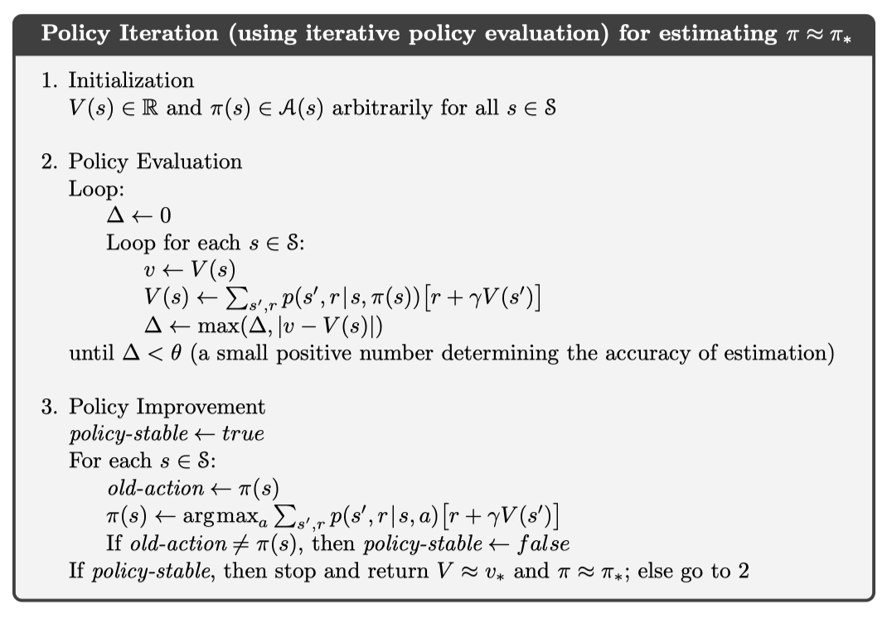

# Assignment 1

Name: Ng Tze Kean

Student number: 721370290002

## Architecture

Classes are created to simulate the agents interacting with the gridworld. The
gridworld acts as the environment which feeds the agent with the data. The agent
will interact with the gridworld by calling for update of the current state with
some action the agent wants to perform. The gridworld will return the reward and
next state to the agent.

## Random algorithm

The random algorithm always performs the worst of the 3 since there is no use of
information to select the optimal action. the random algorithm forms the trivial
base line that the other 2 algorithms should beat to objectively say that there
is an improvement.

## Iterative policy evaluation and iteration

The implementation of the policy evaluation and iteration is as shown in the
textbook.



Whereby the policy evaluation and iteration wrapped in a function and
iteratively called till convergence of the algorithm.

## Value iteration

Value iteration on the other hand will compute the value of quality of the state
that the agent is taking across all possible actions and its future quality
given a state. The quality of the state is then updated with the maximum
possible value that can be attained.


The loop is repeated till convergence where by the optimal action is found. To
compute the best action, we can either run another iteration of the training
process to obtain the best action or we could create a function that finds the
$\argmax_a V(s)$ and have the agent take that action.

## Results

Running the `main.py` program will run the _RandomAgent_ agent, followed by
_IterativePolicyEvaluation_ then _ValueIteration_. We can see from the output
how the agent moves through the gridworld and the number of steps taken.

Since there are 2 goal states, the agent will prioritize the goal state that is
closest to the start location.

### Use of program

To change the starting position of the program, one can modify line _180_ of the
code to change the starting position.

```python
grid = Gridworld(start=30)
```

The other parameters of the agents can also be selected to change how the agent
will learn from the environment. As for the other agents (not including the
random agent), they would have to be first trained to learn the policy or value
of the state before an optimal action can be learnt.
